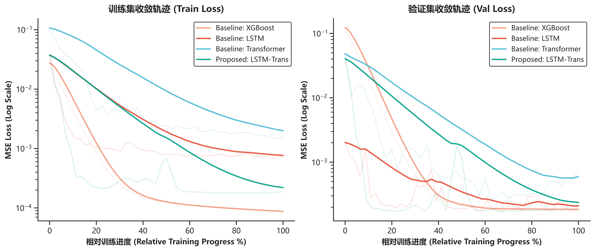
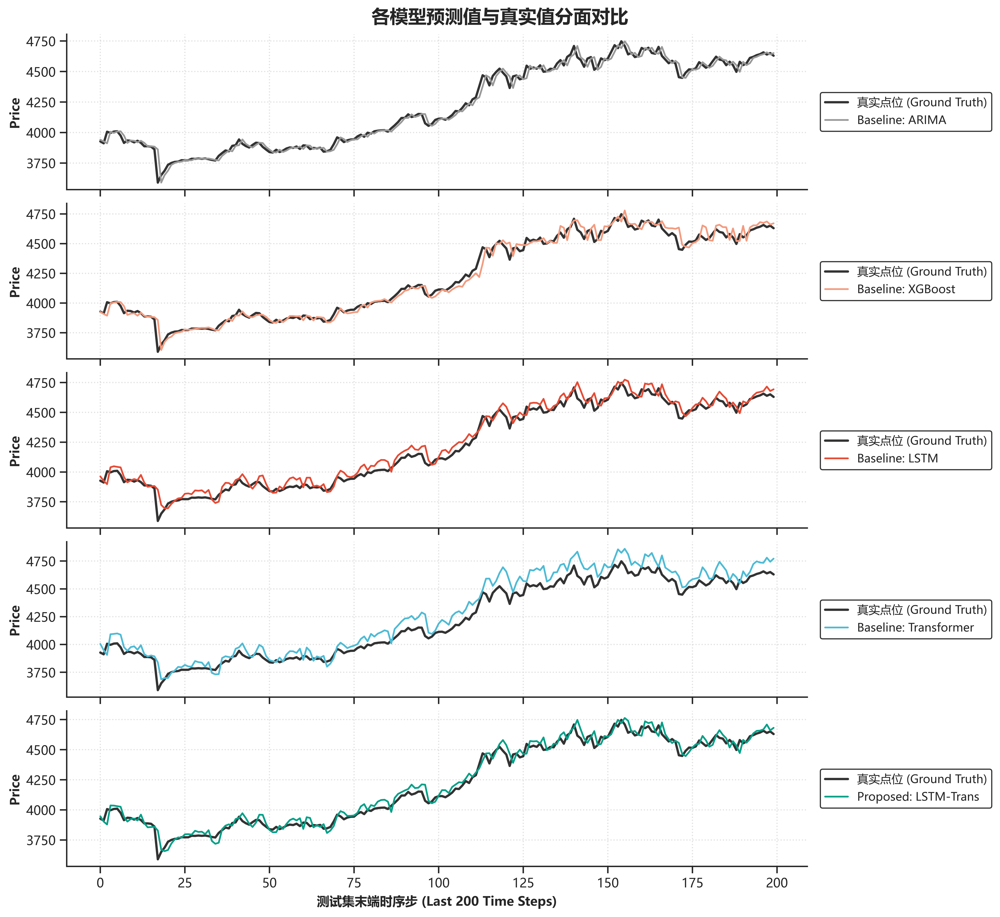
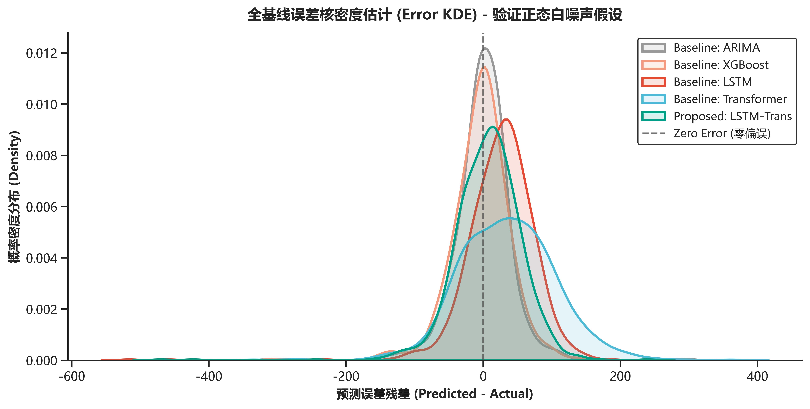

# 1 绪论
## 1.1 研究背景与意义
- 传统金融量化谈到深度学习的崛起。
## 1.2 国内外研究现状
### 1.2.1 传统统计学模型在金融预测中的应用（ARIMA）
### 1.2.2 机器学习模型在金融预测中的应用（XGBoost）
### 1.2.2 深度学习在时间序列预测中的应用（LSTM）
### 1.2.3 Transformer架构在时间序列中的前沿探索。
## 1.3 本文主要研究内容与贡献
- 融合模型
## 1.4 论文组织结构
    
# 2 相关理论与技术基础
## 2.1 时间序列预测基本理论
- 金融时间序列的非平稳性、非线性特征
## 2.2 长短期记忆网络（LSTM）原理
- 画出LSTM的细胞结构图
- 写出遗忘门、输入门、输出门的数学公式
## 2.3 Transformer与自注意力机制（Self-Attention）
- Transformer原理图
- 多头注意力机制（Multi-Head Attention）的数学推导。
## 2.4 深度学习模型评价指标
- 列出 MSE，RMSE, MAE, R²，MAPE公式。

# 3 多维量价特征工程与数据处理 
## 3.1 实验数据来源与说明

本文选取**沪深300指数（CSI 300）** 作为主要研究标的。沪深300指数由上海和深圳证券交易所中市值大、流动性好的300只股票组成，综合反映了中国A股市场的整体表现，具有代表性强、数据连续性好的特点，是检验量价预测模型的理想对象。

实验使用的日频行情数据时间跨度为 **2006年3月1日至2025年12月31日**。原始数据字段包括：日期（`date`）、开盘价（`open`）、最高价（`high`）、最低价（`low`）、收盘价（`close`）、成交量（`volume`）、成交额（`amount`）。金融时间序列常因市场节假日、休市等原因产生缺失值。为维持时间序列的连续性，本实验采用金融数据分析中广泛使用的**前向填充（Forward Fill, ffill）** 方法进行处理。即，若某交易日数据缺失，则使用前一个有效交易日的数值进行填充。此方法假设市场在非交易期间状态未发生突变，是处理金融日历数据缺失的合理惯例。

## 3.2 基础量价数据分析：

原始行情数据是市场行为最直接的记录，构成了特征工程的基础层。每个交易日的数据包含以下核心字段：
*   **开盘价（Open）**：交易日开始时的第一笔成交价格。
*   **最高价（High）**：交易日内达到的最高成交价格。
*   **最低价（Low）**：交易日内达到的最低成交价格。
*   **收盘价（Close）**：交易日结束前的最后一笔成交价格，是金融分析中最常使用的基准价格。
*   **成交量（Volume）**：交易日内成交的股票总手数，表征市场的活跃程度与流动性。
*   **成交额（Amount）**：交易日内成交的货币总金额。

收盘价与成交量（量价关系）是技术分析的基石，其变化模式蕴含着供需关系、投资者情绪与资金流向等信息。然而，原始数据维度有限且噪声较高，直接用于复杂模型预测效果有限，因此需要进行深入的特征工程。

## 3.3 衍生技术指标构造：

为向模型提供更丰富、更具判别性的信息，本节系统化地构建了一个涵盖技术指标、外部动量和时间周期的多维特征库。

### 3.3.1 衍生技术指标特征

技术指标通过对历史价格和成交量进行数学变换，旨在识别趋势、动量和波动率等模式。本实验选取了以下几类经典指标：

**1. 移动平均线（Moving Averages）**
移动平均线通过平滑价格序列来识别趋势方向。实验计算了短期（5日）和中期（20日）简单移动平均线（SMA）。
$$ SMA_t(N) = \frac{1}{N} \sum_{i=0}^{N-1} Close_{t-i} $$
其中，$SMA_t(5)$和$SMA_t(20)$分别反映了短期和中期市场平均成本，其相互位置与价格的关系可用于判断趋势强度与潜在反转。

**2. 相对强弱指数（Relative Strength Index, RSI）**
RSI通过比较特定周期内价格上涨与下跌的幅度来衡量资产的超买或超卖状态。计算公式为：
$$ RS = \frac{\text{AvgGain over N periods}}{\text{AvgLoss over N periods}} $$
$$ RSI = 100 - \frac{100}{1 + RS} $$
本实验采用14日周期（$N=14$）。RSI值在0到100之间，通常认为高于70表明超买，低于30表明超卖，能够捕捉价格动量的衰竭点。

**3. 平滑异同移动平均线（MACD）**
MACD用于识别趋势的变化、方向、动量和持续时间。它由三部分组成：
*   **DIF（差离值）**：短期EMA与长期EMA之差。本实验采用标准参数（12， 26）。
    $$ DIF_t = EMA_t(12) - EMA_t(26) $$
*   **DEA（信号线）**：DIF的9日EMA， $DEA_t = EMA(DIF, 9)$。
*   **MACD柱状图**：DIF与DEA之差， $MACD\_hist_t = DIF_t - DEA_t$。
MACD的交叉与柱状图缩放能有效揭示趋势的加速与减速。

**4. 布林带（Bollinger Bands, BB）**
布林带由一条中轨（N日SMA）和两条上下轨（中轨加减N倍标准差）组成，用于衡量价格波动率和识别极端价格。
$$ BB\_middle_t = SMA_t(N) $$
$$ BB\_std_t = \sqrt{\frac{1}{N} \sum_{i=0}^{N-1} (Close_{t-i} - BB\_middle_t)^2} $$
$$ BB\_upper_t = BB\_middle_t + k \cdot BB\_std_t $$
$$ BB\_lower_t = BB\_middle_t - k \cdot BB\_std_t $$
本实验采用$N=20, k=2$的标准参数。此外，还计算了带宽（$BB\_width$，反映波动率）和百分比（$BB\_\%B$，反映价格在通道内的相对位置）作为特征。

### 3.3.2 宏观、资金与跨市场特征

为引入更广泛的市场驱动信息，本实验模拟引入了**北向资金动量**作为代表“聪明钱”动向的外部特征。在实际应用中，此类特征可扩展为国债收益率、汇率、大宗商品价格等宏观变量。

对于这类外部时序特征，必须进行两项关键处理以符合建模要求：

### 3.3.3 时间周期编码

金融市场存在显著的日历效应，如“周内效应”（Weekend Effect）和“月份效应”（Month-of-the-Year Effect）。为让模型能够捕捉这种周期性规律，本实验对时间特征进行了连续性编码。

传统的整数编码（如周一=0， 周日=6）会引入边界不连续性：周日（6）与周一（0）在时间上是连续的，但在数值空间上距离最大。为解决此问题，采用正弦（Sine）和余弦（Cosine）函数将一维离散时间点映射到二维单位圆上，公式如下：

设原始时间特征为 $t$（星期几 $d \in [0,6]$，月份 $m \in [1,12]$），其周期长度为 $T$（$T_{week}=7$, $T_{month}=12$），则编码为：
$$ \text{enc\_sin} = \sin\left(\frac{2\pi \cdot t}{T}\right) $$
$$ \text{enc\_cos} = \cos\left(\frac{2\pi \cdot t}{T}\right) $$

此方法确保了周期性：周日与周一的编码在二维空间中位置接近。同时，必须同时使用正弦和余弦分量以保证每个时间点在二维平面上的唯一性。最终，生成了 `sin_dow`, `cos_dow`, `sin_month`, `cos_month` 四个特征。

## 3.4 数据预处理
在完成特征构建后，必须经过严格的预处理流程才能将数据转化为适用于深度学习模型训练的样本.
### 3.4.1 归一化处理

深度学习模型对输入特征的尺度敏感。本实验采用 **最小-最大归一化（Min-Max Scaling）** 将特征映射到[0, 1]区间，公式如下：
$$ X' = \frac{X - X_{min}}{X_{max} - X_{min}} $$

为防止前视偏差，归一化参数的拟合必须严格遵守时间顺序。本实验按时间顺序将数据划分为训练集（72%）、验证集（10%）和测试集（18%）。**归一化操作所需的最小值（$X_{min}$）和最大值（$X_{max}$）仅从训练集数据中计算得到**。然后，使用训练集上拟合好的缩放器（Scaler）分别对验证集和测试集进行变换。这意味着模型在训练和评估的任一阶段，都未曾接触到未来数据的全局分布信息。

目标变量（收盘价`close`）同样进行独立的归一化，并保存其缩放器参数，以便在模型预测完成后，将预测值逆变换回原始价格尺度，用于计算最终的评估指标（如RMSE, MAPE）。

### 3.4.2 时序滑动窗口切分

LSTM与Transformer等模型要求输入为固定长度的序列。本实验采用滑动窗口（Sliding Window）机制将一维时间序列转化为此实验所需的样本对。

给定总特征序列，设定历史窗口长度（Look-back window）$L_{seq}=60$，预测窗口长度 $L_{pred}=1$。对于时间点 $t$，构建一个输入-输出对 $(X_t, y_t)$：
*   **输入 $X_t$**：一个形状为 $(L_{seq}, num\_features)$ 的矩阵，包含从 $t-L_{seq}+1$ 到 $t$ 时刻的所有特征。
*   **输出 $y_t$**：一个标量，即 $t+1$ 时刻的目标值（归一化后的收盘价）。

随后，窗口以步长 $step=1$ 向后滑动，生成下一个样本对 $(X_{t+1}, y_{t+1})$。此过程遍历整个数据集（需跳过起始和结尾的边界）。最终，所有样本被堆叠成两个三维张量：
*   **输入张量 $X$**: 形状为 $(N, L_{seq}, num\_features)$，其中 $N$ 为总样本数。
*   **输出张量 $y$**: 形状为 $(N, L_{pred})$。

此滑动窗口样本构建方法在训练集、验证集和测试集内部独立进行，并确保了时间顺序的严格性，为时序预测模型提供了结构化的输入。
        
# 4 LSTM-Transformer融合预测模型设计 
### 4.1 总体架构设计
本节详细阐述本课题提出的核心创新模型——串行LSTM-Transformer混合架构的设计细节。该架构的设计哲学在于，利用**长短期记忆网络**对时序依赖进行深度特征提取，并在此基础上引入轻量级**Transformer模块**进行全局特征的精炼与增强，以构建一个兼具局部时序建模能力与全局上下文感知能力的稳健预测模型。如图1所示，模型的总体架构由三大模块串联构成：LSTM骨干网络 (Backbone)、Transformer特征精炼模块以及最终的预测头。

模型的输入数据为归一化后的三维张量 ${X} \in {R}^{B \times L \times D}$，其中 $B$ 为批次大小，$L=60$ 为序列长度，$D=22$ 为特征维度（包含量价特征与技术指标）。该张量依次流经以下模块：

1.  **Block 1: LSTM 骨干网络 (Backbone)**
    输入数据首先进入一个单层LSTM模块。其作用是利用门控机制，对长度为60的时序窗口进行编码，捕获价格序列中的短期趋势、周期性与局部非线性模式。LSTM的隐藏层维度设置为128，其输出为编码后的特征序列 ${H}_{\text{LSTM}} \in \mathbb{R}^{B \times L \times 128}$，该序列包含了每个时间步的上下文感知特征。

2.  **Block 2: Transformer 特征精炼模块 (Pre-Norm & ReZero Refinement)**
    ${H}_{\text{LSTM}}$ 随后进入轻量级Transformer精炼模块。本模型采用**Pre-Norm**残差结构，并在残差路径上引入**ReZero (Residual with Zero initialization)** 机制以优化训练稳定性。具体流程如下：
    *   特征序列首先经过一个**LayerNorm**层进行归一化。
    *   随后进入一个**多头自注意力层**。该层设置4个头，每个头的维度为32，总维度保持128。多头机制允许模型从不同子空间并行关注序列中不同位置的依赖关系，从而对LSTM提取的特征进行全局层面的信息整合与重新加权。为防止过拟合，该层后应用了丢弃率为 $p=0.408$ 的Dropout。
    *   注意力层的输出经过一个**ReZero乘法器**。ReZero是一种简单的残差连接优化方法，它将残差路径的输出乘以一个可学习的标量参数 $\alpha$（初始值为0），其更新公式为：$x_{l+1} = x_l + \alpha_l \cdot F(x_l)$。在训练初期，$\alpha \approx 0$ 使得网络近似恒等映射，极大地稳定了深度网络的训练。
    *   最后，通过一个加法操作完成第一次残差连接，将ReZero处理后的特征与模块的原始输入 ${H}_{\text{LSTM}}$ 相加。
    *   相加后的特征再依次通过第二个**LayerNorm层**、一个**前馈网络**以及第二个**ReZero乘法器**，并最终通过第二次残差连接完成模块的输出。前馈网络采用两层全连接结构（128 → 256 → 128），中间使用ReLU激活函数，同样应用了 $p=0.408$ 的Dropout。该模块的输出 ${H}_{\text{Refined}} \in \mathbb{R}^{B \times L \times 128}$ 是经过全局上下文信息增强的时序特征。

3.  **Block 3: 预测头 (Prediction Head)**
    为进行单步预测，我们提取精炼后特征序列 ${H}_{\text{Refined}}$ 的最后一个时间步特征 ${H}_{\text{Refined}}[:, -1, :] \in \mathbb{R}^{B \times 128}$，这代表了编码了全部历史信息的最新状态。该特征向量最后通过一个线性层（全连接层）映射为一维标量，即最终的预测值 $\hat{y} \in \mathbb{R}^{B \times 1}$。

综上所述，本模型的数据流向遵循清晰的串行路径：`原始输入 → LSTM特征提取 → Transformer全局精炼 → 提取最终状态 → 线性预测`。该设计确保了LSTM和Transformer优势的互补，并通过Pre-Norm与ReZero机制保障了深层混合网络训练的可行性与效率。

## 4.2 局部序列特征提取（LSTM模块）
    - 解释为什么用LSTM作为前置特征提取器。
## 4.3 全局时序依赖捕捉（Transformer模块）
    - 解释怎么把LSTM的输出喂给Transformer的Encoder。
## 4.4 模型训练策略
为了在 LSTM、Transformer 以及 LSTM-Transformer 混合架构之间进行严谨且公平的性能评估，本研究设计了一套基于贝叶斯优化的自动化超参数搜索（Hyperparameter Optimization, HPO）机制。不同神经网络架构对超参数的敏感度差异显著（例如，Transformer 极易受学习率和批次大小影响），若采用统一的固定超参数，将引入严重的评估偏见。因此，本研究采用 Optuna 框架对各模型进行彻底的超参数解耦与独立寻优，确保最终性能对比建立在各架构的最佳状态之上。

**1. 公平性约束与搜索策略**
为保证对比实验的公平性，本研究确立了以下搜索约束原则：
*   **同等搜索深度**：为三种模型分别配置了相互独立的搜索进程，每个模型均进行 150 次试验（Trials），确保搜索空间的探索程度一致。
*   **目标函数统一**：所有试验均以验证集上的均方误差（Validation MSE）作为最小化目标，以此来指导贝叶斯优化器更新采样概率。

**2. 架构对等的超参数搜索空间**
本研究构建了一个兼顾全局共享与架构特异性的超参数搜索空间。
*   **全局共享参数**：包括学习率（$10^{-5}$ 至 $5 \times 10^{-3}$，对数采样）、权重衰减率（$10^{-5}$ 至 $10^{-1}$，对数采样）、Dropout 比例（0.2至0.6），以及批次大小（Batch Size $\in \{32, 64, 128, 256\}$）。此外，为保证多头注意力机制（Multi-Head Attention）的维度整除合理性，隐藏层维度（Hidden Dimension）被严格限制在 $\{32, 64, 128\}$ 离散集合中。
*   **架构特异性参数**：针对序列模型与注意力模型，动态调整网络深度与宽度。LSTM 与 Transformer 的层数搜索范围均为 1至2层；注意力头数限制在 $\{2, 4, 8\}$；前馈神经网络（FFN）的扩展倍数在 2至4 之间动态采样。

**3. 稳定训练与自适应调度机制**
考虑到 Transformer 架构在时间序列预测任务中容易出现梯度爆炸或对固定学习率不收敛的问题，本实验设计了稳健的训练协议：
*   **自适应学习率衰减**：引入 `ReduceLROnPlateau` 调度器。当验证集损失在连续 5 个 Epoch 内未改善时，学习率将自动衰减至当前的一半（Factor=0.5），最低衰减至 $10^{-6}$。
*   **梯度裁剪与早停**：所有模型均设定最大训练轮数为 100 Epochs，并设置全局梯度裁剪阈值为 1.0 以抑制异常梯度。配合 Patience 为 15 的早停（Early Stopping）机制，有效防止模型在搜索后期过拟合。

**4. 计算资源优化与早退剪枝**
为提升 HPO 的搜索效率，本研究引入了中位值剪枝算法（Median Pruner）。该算法在初始的 5 次预热试验和每个试验的前 10 步评估后激活，自动中止那些表现处于历史下半区的劣质试验，大幅节约了计算算力。此外，针对大模型（如高维度多层的并行混合架构）在极端超参数组合下可能引发的显存溢出（Out-Of-Memory, OOM）问题，系统设计了异常捕获机制，自动舍弃导致 OOM 的超参数组合并执行显存回收（Garbage Collection），保障了多模型并发搜索的稳定性。

各模型超参数搜索空间与范围如下表所示

| 模型类别                    | 超参数             | 搜索范围/候选值        | 说明                                                       |
| :-------------------------- | :----------------- | :--------------------- | :--------------------------------------------------------- |
| **所有DL模型**              | `lr`               | [1e-5, 5e-3]，对数尺度 | 优化器学习率                                               |
|                             | `batch_size`       | {32, 64, 128, 256}     | 训练批大小                                                 |
|                             | `weight_decay`     | [1e-5, 1e-1]，对数尺度 | L2 正则化系数                                              |
|                             | `dropout`          | [0.2, 0.6]             | Dropout 比例                                               |
|                             | `hidden_dim`       | {32, 64, 128}          | 模型隐藏层维度                                             |
| **LSTM**                    | `num_layers`       | [1, 2]                 | LSTM堆叠层数                                               |
| **Transformer**             | `num_heads`        | {2, 4, 8}              | 注意力头数                                                 |
|                             | `num_layers`       | [1, 2]                 | Transformer编码器层数                                      |
|                             | `ffn_multiplier`   | [2, 4]                 | FFN隐藏层倍数 ($ffn\_dim = hidden\_dim \times multiplier$) |
| **LSTM-Transformer (串行)** | `num_lstm_layers`  | [1, 2]                 | 混合架构中LSTM的层数                                       |
|                             | `num_trans_layers` | [1, 2]                 | 混合架构中Transformer的层数                                |
|                             | `num_heads`        | {2, 4, 8}              | 注意力头数                                                 |
|                             | `ffn_multiplier`   | [2, 4]                 | FFN隐藏层倍数                                              |
| **XGBoost**                 | `n_estimators`     | [50, 500]              | 弱学习器数量                                               |
|                             | `max_depth`        | [3, 10]                | 树的最大深度                                               |
|                             | `learning_rate`    | [1e-3, 0.3]，对数尺度  | 学习率                                                     |
|                             | `subsample`        | [0.5, 1.0]             | 样本采样比例                                               |
|                             | `colsample_bytree` | [0.5, 1.0]             | 特征采样比例                                               |
| **ARIMA**                   | `p`                | [0, 5]                 | 自回归项数                                                 |
|                             | `d`                | [0, 1]                 | 使序列平稳的最小差分次数                                   |
|                             | `q`                | [0, 5]                 | 移动平均项数                                               |

# 5 实验结果与性能分析
## 5.1 实验环境与参数设置

通过4.4的超参数搜索，最终各个模型的超参数如下表所示
| 模型                        | 最优训练参数 (`train_args`)                                      | 最优模型参数 (`model_args`)                                                                                                         |
| :-------------------------- | :--------------------------------------------------------------- | :---------------------------------------------------------------------------------------------------------------------------------- |
| **LSTM**                    | `batch_size`: 128 `lr`: 2.068e-3 `weight_decay`: 1.556e-05 | `hidden_dim`: 128 `num_layers`: 1 `dropout`: 0.216                                                                            |
| **Transformer**             | `batch_size`: 32 `lr`: 1.054e-3 `weight_decay`: 9.590e-04  | `d_model`: 128 `num_heads`: 2 `num_layers`: 2 `ffn_dim`: 512 (4\*128) `dropout`: 0.265                                  |
| **LSTM-Transformer (串行)** | `batch_size`: 128 `lr`: 3.476e-3 `weight_decay`: 2.416e-05 | `hidden_dim`: 128 `num_lstm_layers`: 1 `num_trans_layers`: 2 `num_heads`: 4 `ffn_dim`: 256 (2\*128) `dropout`: 0.408 |
| **XGBoost** |  | `n_estimators`: 288 `max_depth`: 3 `learning_rate`: 0.03295 `subsample`: 0.7325 `colsample_bytree`: 0.9088 |
| **ARIMA**   |  |`order`: (0, 1, 0)                                                                                                     |

## 5.2 结果分析

| Model             | MSE               | RMSE          | MAE           | R²              | MAPE%       |
| ----------------- | ----------------- | ------------- | ------------- | --------------- | ----------- |
| ARIMA             | 1765.83 ± 0.00    | 42.02 ± 0.00  | 28.74 ± 0.00  | 0.9853 ± 0.0000 | 0.74 ± 0.00 |
| XGBoost           | 1972.16 ± 43.34   | 44.41 ± 0.49  | 30.91 ± 0.37  | 0.9836 ± 0.0004 | 0.80 ± 0.01 |
| LSTM              | 3081.77 ± 294.51  | 55.45 ± 2.59  | 40.30 ± 2.53  | 0.9744 ± 0.0024 | 1.04 ± 0.07 |
| Transformer       | 7402.78 ± 2428.89 | 84.91 ± 13.89 | 67.77 ± 13.83 | 0.9385 ± 0.0202 | 1.73 ± 0.35 |
| Serial LSTM-Trans | 2759.93 ± 150.43  | 52.52 ± 1.43  | 37.28 ± 1.71  | 0.9771 ± 0.0012 | 0.97 ± 0.04 |

## 5.3 参数敏感性分析（maybe，未完成）
- 滑动窗口长度（如分别取10天、20天、30天、60天）对RMSE的影响 and so on

# 6 总结与展望
## 6.1 总结
## 6.2 展望
模型没有引入新闻情绪文本分析（NLP），没有进行深入的特征工程分析，作为未来改进方向。

